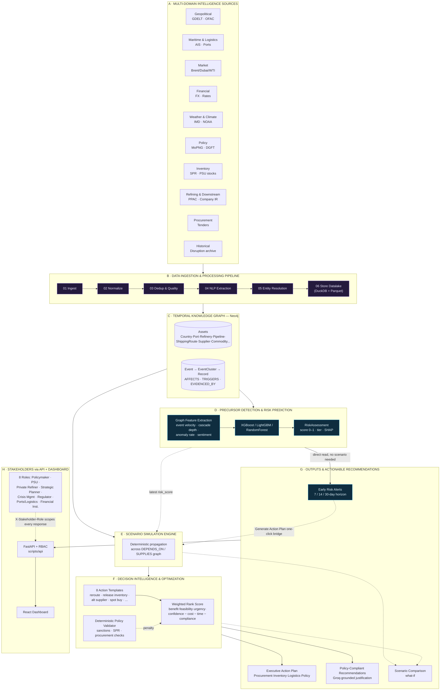
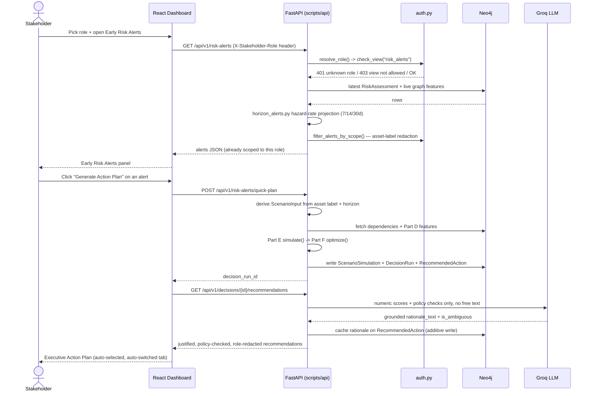
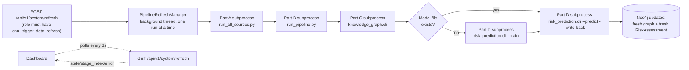

# SupplySense-AI

### AI-Driven Energy Supply Chain Resilience System

**Anticipate risks. Simulate impact. Recommend policy-compliant actions.**

SupplySense-AI ingests real signals from 10 intelligence domains, fuses them into a temporal knowledge graph, predicts disruption risk on India's energy supply chain assets before it fully materializes, simulates what-if scenarios, and turns all of it into ranked, policy-checked, LLM-justified recommendations — surfaced to eight distinct stakeholder personas through a role-scoped API and dashboard.

Every number in the system is traceable to a real signal, a real graph query, or a real deterministic formula. Nowhere in the recommendation path is a score invented — this document explains exactly how each figure is produced, so the reasoning behind every recommendation can be audited end to end.

---

## Table of Contents

1. [System Architecture](#1-system-architecture)
2. [What Each Part Does](#2-what-each-part-does)
3. [Runtime Architecture](#3-runtime-architecture)
4. [Why the Recommendations Are Trustworthy](#4-why-the-recommendations-are-trustworthy)
5. [Stakeholder Access Matrix (Part H)](#5-stakeholder-access-matrix-part-h)
6. [Tech Stack](#6-tech-stack)
7. [Repository Structure](#7-repository-structure)
8. [Running the System](#8-running-the-system)
9. [API Reference](#9-api-reference)
10. [Evaluation Focus: How Each Criterion Is Addressed](#10-evaluation-focus-how-each-criterion-is-addressed)
11. [Known Limitations](#11-known-limitations)

---

## 1. System Architecture



**Reading the diagram:** solid arrows are the primary data flow (ingest → graph → predict → simulate → optimize → present). The dotted arrow from **D → G1** is deliberate — Early Risk Alerts read Part D's `RiskAssessment` directly and need no scenario, which is what makes them real-time. The dotted **G1 → E** arrow is the "Generate Action Plan" bridge: it is the one place a real-time alert is turned into a full what-if scenario on demand, closing the loop between detection and action without requiring an analyst to hand-build a scenario first.

---

## 2. What Each Part Does

| Part | Module | Responsibility | Output |
|---|---|---|---|
| **A** | `scripts/ingestion/` | 10 independent domain scrapers (geopolitical, maritime_logistics, market, financial, weather_climate, policy, inventory, refining_downstream, procurement, historical) pulling from GDELT, AIS/MarineTraffic-style feeds, EIA, IMD/NOAA, PPAC, company filings, etc. | Raw JSONL under `data/raw/` |
| **B** | `scripts/pipeline/01`–`06`, `run_pipeline.py` | Normalize units/timestamps → dedup + quality/anomaly flagging → spaCy/NLTK NLP extraction (entities, sentiment, urgency) → entity resolution/aliasing → store to DuckDB + partitioned Parquet | `data/datalake/` |
| **C** | `scripts/knowledge_graph/` | Loads processed records into Neo4j as a temporal graph: 12 asset types (`Country, Port, Terminal, Refinery, StorageTerminal, Pipeline, PowerIndustry, Consumer, Supplier, Commodity, ShippingRoute, Organization`) connected by physical relationships (`SUPPLIES, CONNECTS_TO, TRANSPORTED_VIA, ...`) and event relationships (`AFFECTS, TRIGGERS, EVIDENCED_BY, PART_OF_CLUSTER`) | Neo4j graph |
| **D** | `scripts/risk_prediction/` | Extracts 17 graph-derived features per asset (event velocity, domain severity, cascade depth, upstream triggers, anomaly rate, recency...), trains an XGBoost/LightGBM/RandomForest classifier on heuristic precursor labels, scores every asset with SHAP explainability | `RiskAssessment` nodes (`risk_score`, `risk_tier`, `feature_importance`) |
| **E** | `scripts/scenario_simulation/` | Deterministic (no LLM) what-if propagation: given a disruption on N assets, walks the dependency graph and estimates supply shortfall %, inventory depletion days, delay days, refinery utilization loss, economic impact index per affected asset | `ScenarioSimulationResult` |
| **F** | `scripts/decision_optimization/` | Generates candidate actions from 8 templates per impacted asset, runs each through a deterministic policy validator (sanctions keywords, SPR rules, procurement/contract checks, environmental/safety checks), then ranks by a fully-documented weighted score | `DecisionOptimizationResult` (ranked, policy-checked `Recommendation`s) |
| **G** | `scripts/recommendation_output/` | Turns D/E/F outputs into the four stakeholder-facing products (below) | Alerts, action plans, justified recommendations, comparisons |
| **H** | `scripts/api/`, `frontend/` | FastAPI service enforcing an 8-role access matrix server-side (not just hidden in the UI) + React dashboard | REST API + dashboard |

### Part G in detail

| Output | How it's produced | File |
|---|---|---|
| **Early Risk Alerts** (7/14/30d) | Treats Part D's `risk_score` as an implied probability at the model's training window, inverts the constant-hazard survival CDF for a base hazard rate, then adjusts it per asset using **live** momentum (event acceleration), recency (time since last event), and persistence (cascade depth/upstream triggers) — fully documented, monotonic, and grounded in real Part D features, not a second model | `horizon_alerts.py` |
| **Executive Action Plan** | Groups Part F's ranked recommendations into Procurement / Inventory / Logistics / Policy using the fixed action-template mapping, with real aggregate stats (Σ impact reduction, avg urgency, avg confidence) | `action_plan.py` |
| **Policy-Compliant Recommendations** | Groq (`llama-3.1-8b-instant`) receives *only* Part F's already-computed scores and policy-check results and is instructed to render one grounded sentence — never to invent facts, re-rank, or change compliance status. Flags internally-inconsistent recommendations (`is_ambiguous`) for analyst review. Falls back to a deterministic template if no Groq key is present, so the system is never LLM-dependent to function | `justification.py` |
| **Scenario Comparison** | Reads N `ScenarioSimulation`/`DecisionRun` pairs from Neo4j and lines up impact, cost, and compliance side by side | `comparison.py` |
| **Quick Action Plan from Alert** | The one-click bridge: takes a bare risk alert (asset + horizon), auto-derives a `ScenarioInput` (disruption type inferred from asset label, duration = the horizon you were viewing), and runs the full E→F pipeline on demand | `scripts/api/main.py::quick_action_plan_from_alert` |

---

## 3. Runtime Architecture

### 3.1 Live request path (every dashboard interaction)



### 3.2 Background data-refresh chain

Parts A–D are independent CLI scripts that call `sys.exit()` on completion — safe to run as a subprocess, unsafe to import into a long-lived server. `scripts/api/pipeline_runner.py` orchestrates them as real OS subprocesses on a background thread so a stakeholder can trigger a full refresh from the dashboard without blocking the API:



The chain auto-inserts the training stage only when no model artifact exists yet (`models/` is gitignored, so a fresh checkout self-heals on first refresh) — a repeat run skips straight to `--predict`.

---

## 4. Why the Recommendations Are Trustworthy

This system is judged on the reasoning behind its recommendations, not just their existence — so every layer is built to be inspectable:

- **No black-box scores.** Every number — `risk_score`, `impact_score`, `rank_score`, `hazard_rate` — is a documented formula over real features, not a fitted opacity. Part F's `Recommendation.rationale` dict and Part D's SHAP `feature_importance` expose the inputs behind every output.
- **LLM used strictly as a renderer, never a decision-maker.** Groq only ever receives numbers Part F already computed and is hard-instructed not to invent facts, not to re-rank, and to flag internal inconsistencies rather than paper over them. The system is fully functional without it (template fallback).
- **Deterministic policy compliance, not a demo list.** `scripts/decision_optimization/policy.py` runs real rule checks per action type (sanctions keyword screening, SPR/min-stock validation, procurement authority checks, port/maritime safety, environmental clearance) and can hard-block a recommendation (`BLOCKED`) — it isn't cosmetic.
- **RBAC enforced server-side, twice.** `auth.py` both gates access (`403` before any Part D–G code runs) and redacts the response payload itself (asset scope, action-plan categories, compliance/financial detail) — a restricted role cannot see out-of-scope data even with a known `decision_run_id`.
- **Full audit trail.** Every view, generation, and system-refresh trigger is written as an `AuditLogEntry` node in Neo4j, queryable by roles with `can_view_audit_log`.
- **Closed loop, not a one-shot demo.** The "Generate Action Plan" bridge means a real-time detected risk can become a ranked, justified, policy-checked action plan in one click — the system doesn't stop at "here's a risk score."

---

## 5. Stakeholder Access Matrix (Part H)

Defined in `config/stakeholder_roles.yaml`, enforced in `scripts/api/auth.py`. Every request carries an `X-Stakeholder-Role` header; unknown roles get `401`, permitted-but-out-of-scope requests get `403` or silently redacted fields.

| Role | Organizations | Asset Scope | Compliance Detail | Financial Detail | Generate Justification | Audit Log | Trigger Data Refresh |
|---|---|---|---|---|:---:|:---:|:---:|
| Policymaker | MoPNG, NITI Aayog, MEA | All | ✅ | ✅ | ✅ | ✅ | ✅ |
| PSU | IOC, BPCL, HPCL, GAIL | Refinery/Storage/Pipeline/Supplier/Commodity/Port/Terminal | ✅ | ✅ | ✅ | — | — |
| Private Refiner | Reliance, Nayara, Others | Refinery/Pipeline/Storage/Commodity | ✅ | ✅ | ✅ | — | — |
| Strategic Planner & Analyst | — | All | ✅ | ✅ | ✅ | — | ✅ |
| Crisis Management Team | — | All | ✅ | — | ✅ | — | ✅ |
| Regulator | PPAC, PNGRB, CEA | All (Policy category only) | ✅ | — | — | ✅ | ✅ |
| Ports & Logistics Operator | — | Port/Terminal/ShippingRoute/Pipeline | ✅ | — | ✅ | — | — |
| Financial Institution / Insurer | — | All | — | ✅ | — | — | — |

---

## 6. Tech Stack

| Layer | Technology |
|---|---|
| Ingestion & Processing | Python 3.12, `requests`, `beautifulsoup4`, `feedparser`, `pdfplumber`, `spaCy`, `NLTK` |
| Data Lake | DuckDB + partitioned Parquet |
| Knowledge Graph | Neo4j (Aura), native `neo4j` Python driver |
| ML | XGBoost / LightGBM / scikit-learn RandomForest, SHAP |
| Decision Engine | Pure Python, deterministic weighted scoring |
| LLM | Groq (`llama-3.1-8b-instant`) via the `groq` SDK |
| API | FastAPI + Uvicorn, Pydantic v2 |
| Frontend | React 19, TypeScript, Vite, Tailwind CSS v4, Axios, lucide-react |

---

## 7. Repository Structure

```
SupplySense-AI/
├── config/                          domain sources, entity aliases, stakeholder role matrix
├── scripts/
│   ├── ingestion/                   Part A — 10 domain scrapers
│   ├── pipeline/                    Part B — normalize/dedup/NLP/entity-resolve/store
│   ├── knowledge_graph/             Part C — Neo4j schema + loader
│   ├── risk_prediction/             Part D — feature extraction + ML + SHAP
│   ├── scenario_simulation/         Part E — deterministic what-if engine
│   ├── decision_optimization/       Part F — action templates + policy validator + ranking
│   ├── recommendation_output/       Part G — alerts, action plans, Groq justification, comparison
│   └── api/                         Part G/H — FastAPI service + RBAC + background refresh
├── frontend/                        Part G/H — React dashboard
├── data/                            raw/ processed/ datalake/ (gitignored)
├── models/                          trained risk model artifacts (gitignored, self-heals on refresh)
├── logs/                            per-part run logs + system refresh logs
└── docs/VALIDATION_REPORT.md
```

---

## 8. Running the System

### Prerequisites
- Python 3.11+, Node.js 18+
- A Neo4j instance (Aura or local)
- Optional: `GROQ_API_KEY` for live justification generation (falls back to a template without it)

### Environment (`.env` at repo root)
```
NEO4J_URI=...
NEO4J_USER=...
NEO4J_PASSWORD=...
NEO4J_DATABASE=...
GROQ_API_KEY=...          # optional
AISSTREAM_KEY=...         # Part A maritime ingestion
EIA_API_KEY=...           # Part A market/financial ingestion
```

### Install
```bash
pip install -r requirements.txt
python3 -m spacy download en_core_web_sm
python3 -m nltk.downloader vader_lexicon

cd frontend && npm install
```

### Bring the graph up (first run only — or use the in-app "Ingest New Data & Refresh" button)
```bash
python3 scripts/ingestion/run_all_sources.py      # Part A
python3 -m scripts.pipeline.run_pipeline          # Part B
python3 -m scripts.knowledge_graph.cli            # Part C
python3 -m scripts.risk_prediction.cli --train    # Part D (one-time)
python3 -m scripts.risk_prediction.cli --predict --write-back
```

### Run the app
```bash
python3 -m uvicorn scripts.api.main:app --reload --port 8000   # backend  -> http://localhost:8000
cd frontend && npm run dev                                      # frontend -> http://localhost:5173
```

### Run a what-if scenario from the CLI
```bash
python3 -m scripts.decision_optimization.cli --scenario-file scenario.json --write-back
python3 -m scripts.recommendation_output.cli risk-alerts
python3 -m scripts.recommendation_output.cli justify --decision-run-id <ID> --write-back
```

---

## 9. API Reference

All endpoints require `X-Stakeholder-Role`. Full detail in `scripts/api/README.md`.

| Method | Path | Part | Purpose |
|---|---|---|---|
| GET | `/api/v1/roles` | H | Public role metadata for the role switcher |
| GET | `/api/v1/assets` | — | Asset name search for the scenario builder |
| POST | `/api/v1/scenarios/simulate` | E | Run a scenario simulation |
| POST | `/api/v1/decisions/optimize` | E+F | Run simulation + optimization |
| GET | `/api/v1/decisions` | F | List recent decision runs |
| GET | `/api/v1/risk-alerts` | G | Early Risk Alerts (7/14/30d), role-scoped |
| POST | `/api/v1/risk-alerts/quick-plan` | G | One-click: alert → auto-scenario → decision run |
| GET | `/api/v1/decisions/{id}/action-plan` | G | Executive Action Plan, category-scoped |
| GET | `/api/v1/decisions/{id}/recommendations` | G | Recommendations + cached rationale |
| POST | `/api/v1/decisions/{id}/recommendations/generate` | G | Groq-generate + persist rationale |
| POST | `/api/v1/scenarios/compare` | G | Scenario comparison / what-if |
| GET / POST | `/api/v1/system/refresh` | A–D | Status / trigger the data-refresh chain |
| GET | `/api/v1/system/performance` | G | Aggregate signal→recommendation latency (median/P95, real measured samples) |
| GET | `/api/v1/system/detection-accuracy` | D | Compound model vs. single-sensor baselines, live |
| GET | `/api/v1/decisions/{id}/assumptions` | E | Full scenario assumptions (source-tagged) + drivers |
| GET | `/api/v1/audit-log` | H | Audit trail (role-gated) |

---

## 10. Evaluation Focus: How Each Criterion Is Addressed

| Criterion | Where it's answered |
|---|---|
| **Disruption signal detection lead time & accuracy vs. single-sensor baselines** | `scripts/risk_prediction/baseline_comparison.py` + `GET /api/v1/system/detection-accuracy` (**Detection Accuracy** tab). Compares the fused multi-signal model against five single-signal-only baselines (geopolitical score alone, event count alone, urgency alone, anomaly rate alone, cascade depth alone) on the same ground truth, live against the current graph — not a canned number. In the current data, single-signal baselines miss up to 100% of at-risk assets (false-negative rate) that the fused model catches. Lead time is addressed structurally: a single-sensor threshold is a static yes/no snapshot with no time axis, while the compound model's horizon projection (`horizon_alerts.py`) produces an explicit forward-looking 7/14/30-day curve — see the `lead_time_note` field in the API response for the full, honest reasoning, including why a dated historical backtest isn't yet possible (see Known Limitations). |
| **Quality & executability of procurement alternatives** | `scripts/recommendation_output/alternates.py`. `spot_procurement`/`activate_alternate_supplier` recommendations are enriched with real, named alternate entities pulled live from the graph (not invented), ranked by actual geographic proximity (haversine distance over real coordinates) with graph-connectivity as a tiebreaker — visible as "Real alternates available" in the **Recommendations** tab. |
| **Scenario model fidelity (assumptions explicit & testable)** | `GET /api/v1/decisions/{id}/assumptions` (**Scenario Model Fidelity** panel). Every Part E assumption is returned with an explicit source tag (`provided_in_scenario` vs. `graph-estimated`) and the exact driver values used to estimate it — testable because those drivers can be recomputed directly from the graph. |
| **Geospatial evidence depth** | `scripts/knowledge_graph/geodata.py` + `backfill_geodata.py`. Real country-centroid and NLP-resolved coordinates now cover 86/103 `Country` and 204/209 `Port` nodes (up from 0 and 1 respectively before this work) — visible as clickable OpenStreetMap links on each risk alert, with assets that genuinely have no location (e.g. a `Commodity` like "Crude Oil") honestly labeled as having no geospatial evidence rather than a fabricated one. |
| **End-to-end response time from signal to recommendation** | Every `optimize`/`quick-plan` call returns a real measured `response_time_seconds`; `GET /api/v1/system/performance` (**Signal → Recommendation Latency** panel) aggregates recent calls into median/P95 — a live, reproducible number, not a claimed one. |

---

## 11. Known Limitations

- **SWIFT/LC Proxy Data**: no free public APIs exist for SWIFT banking channels or Letter of Credit data, so proxy financial indicators (e.g. FX rates) substitute for direct trade-finance intelligence.
- **Low-Volume Domains**: `policy` (DGFT/MoPNG notifications) and `procurement` (GeM tenders) update infrequently on their source portals — zero-row ingestion runs in short intervals are expected, not a pipeline failure.
- **Heuristic precursor labels**: Part D's training labels are a documented heuristic over current graph features (event count, urgency, cascade depth, anomaly rate, geopolitical score), not a backtested validation against confirmed future disruption events. `risk_score` is best read as a precursor-concentration score, not a certified forecast accuracy figure — see `scripts/risk_prediction/dataset.py` for the exact rule set.
- **Event titles**: some market/financial-domain events currently persist without a populated `title` field, limiting single-event drill-down (domain/severity/timestamp are always present).
- **No dated historical backtest yet**: the `historical` ingestion domain currently holds only 4 placeholder sample events (e.g. "Ever Given Suez Canal blockage (2021)"), timestamped at *ingestion* time rather than the real incident date — not enough dated ground truth for a genuine point-in-time lead-time backtest. `scripts/risk_prediction/baseline_comparison.py` documents this honestly and evaluates detection accuracy against the model's own heuristic ground truth instead (see Evaluation Focus below).
- **Role-based access, not full authentication**: Part H is a real, server-enforced authorization/personalization layer keyed on `X-Stakeholder-Role`, not a username/password identity system — matching the architecture's "Stakeholders / Users" scope rather than a general-purpose auth product.
